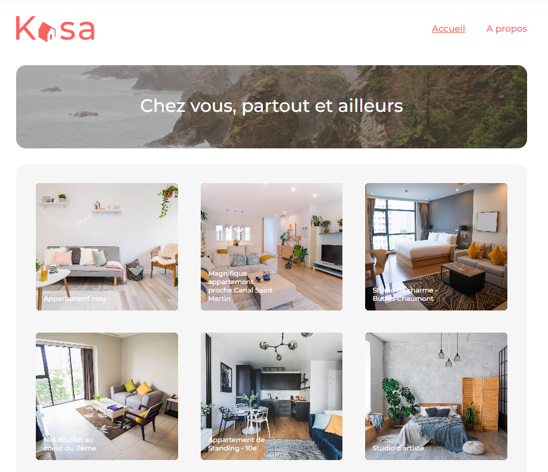

# CarolePignat_7_28072023

### Projet 7 | Parcours "Développeur web" OpenClassrooms - Créez une application web de location immobilière avec React

## Mission
Développer la nouvelle plateforme web de la société Kasa, leader dans la location d'appartements entre a particuliers en France, dans le cadre de la refonte totale du site. Le front-end sera codé en React.

## Spécificités fonctionnelles

* Composant *Gallery* : permet le défilement des photos dans la galerie
    * Si la première image est affichée : au clic sur "Image précédente", affichage de la dernière image
    * Si la dernière image est affichée : au clic sur "Image suivante", affichage de la première image
    * S'il n'y a qu'une seule image : les boutons "Suivant" et "Précédent" n'apparaissent pas
    * Hauteur de la galerie : 
        * Celle indiquée sur la maquette
        * Les images sont coupées et centrées dans le cadre de l'image

* Composant *Collapse* :
    * Par défaut, les *Collapses* sont fermées à l'initialisation de la page
    * Si le *Collapse* est ouvert : au clic, il se ferme
    * Si le *Collapse* est fermé : au clic, il s'ouvre
    
## Spécificités techniques

### Getting Started with Create React App

This project was bootstrapped with [Create React App](https://github.com/facebook/create-react-app).

In the project directory, you can run:

### `npm start`

Runs the app in the development mode.\
Open [http://localhost:3000](http://localhost:3000) to view it in your browser.
